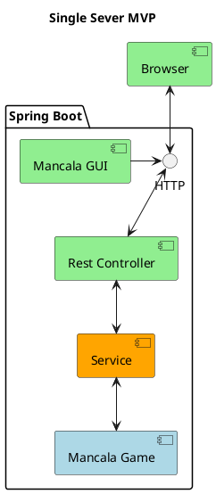
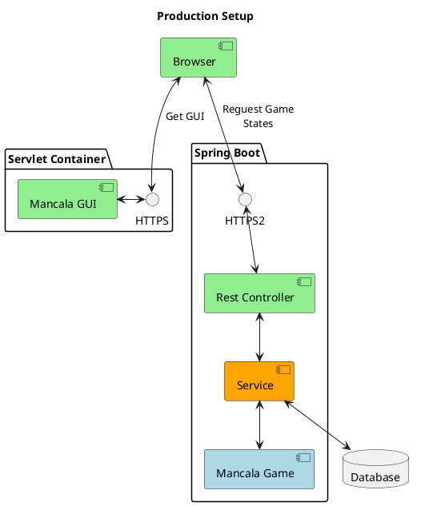

# Mancala Game

## Description
This project offers one approach in implementing the Mancala Game using java based frameworks.
The game in brick and mortar world can be described as such:

* Board Setup
  * Each of the two players has his six pits in front of him. To the right of the six pits,
each player has a larger pit. At the start of the game, there are six stones in each
of the six round pits .
* Rules
  * Game Play
    * The player who begins with the first move picks up all the stones in any of his
  own six pits, and sows the stones on to the right, one in each of the following
  pits, including his own big pit. No stones are put in the opponents' big pit. If the
  player's last stone lands in his own big pit, he gets another turn. This can be
  repeated several times before it's the other player's turn.
  * Capturing Stones
    * During the game the pits are emptied on both sides. Always when the last stone
  lands in an own empty pit, the player captures his own stone and all stones in the
  opposite pit (the other player’s pit) and puts them in his own (big or little?) pit.
  * The Game Ends
    * The game is over as soon as one of the sides runs out of stones. The player who
  still has stones in his pits keeps them and puts them in his big pit. The winner of
  the game is the player who has the most stones in his big pit.
    
## Visuals

The UI for the MVP version is kept simple and clean, pragmatic and functional.
There is a minimalist approach that aims for supporting the maximum amount of features in the shortest of time.
The errors that guide the player are displayed in the header using red.


## Build
### The rule engine and REST API
The module is configured to be built using gradle and is written using the Java language. \
Make sure that Java is installed and available and either your OS has a valid gradle installation or your IDE can embed it.
  * Recommended Java version: JDK 11 
  * Recommended Gradle version: 7.4.1
Before building the project consider running the Unit and Integration test. All can be ran sequentially using the command:
```
$ gradle test
```

With gradle commands available run:
```bash
</project_folder/>$ gradle bootJar
```
This will generate an executable jar file in 
```
</project_folder/>/build/libs/
```

## Installation
### The rule engine and REST API
Starting the Spring Boot server is done by running the next command in the terminal:

```bash
</project_folder/>$ java -jar build/libs/mancala-game*.jar
```
In an linux environment the server can be started as a daemon using the next command instead:
```bash
</project_folder/>$ nohup java -jar build/libs/mancala-game*.jar &
```
The Swagger-UI will be available after the application starts, at: 
```
http://localhost:8888/swagger-ui/
```


### Mancala Game UI MVP
The Mancala Game UI for the MVP version is already compiled as the latest version in the project folder:
```
</project_folder/>/src/main/resources/static/index.html
```
The UI is written with [Elm](https://guide.elm-lang.org/install/elm.html) and so it needs Elm installed on the build server in order to recompile it (if desired). The source code can be found in the same folder:
```
</project_folder/>/src/main/resources/static/src/Main.elm
```


## Usage
### REST API and Swagger-UI

The API server is integrated with Swagger-UI that exposes all the available endpoints of the server to provide more information and facilitate testing and understanding them.
Each individual endpoint can be tested by expanding it and providing the necessary information


## System description
### MVP System components
The MVP version is meant for having a quick iteration of the game while including most features.
It has a simple architecture and it is using the minimum infrastucture: the UI and the backend are runnning on the same server instance and there is no DB.
The progression of the game is achived by maintaing the state of the game in side the conversation between the browser client and the backend server.
The code is crafted with clear purpose for readability, concisness and easiness of change.



### Information Flow

This is a sequence diagram representation of the flow of data durring the most common exchanges in the game modules.


### Production System 
Should the production version ever be implmented then everything can be bumped up to the next level.
Starting from a separation between Frontend and Backend servers along with a dedicated DB server and culminating with implementing security and account based gaming with game state retentinon. 
The UI can also be implemented using a more popular framework like Angular or React.


